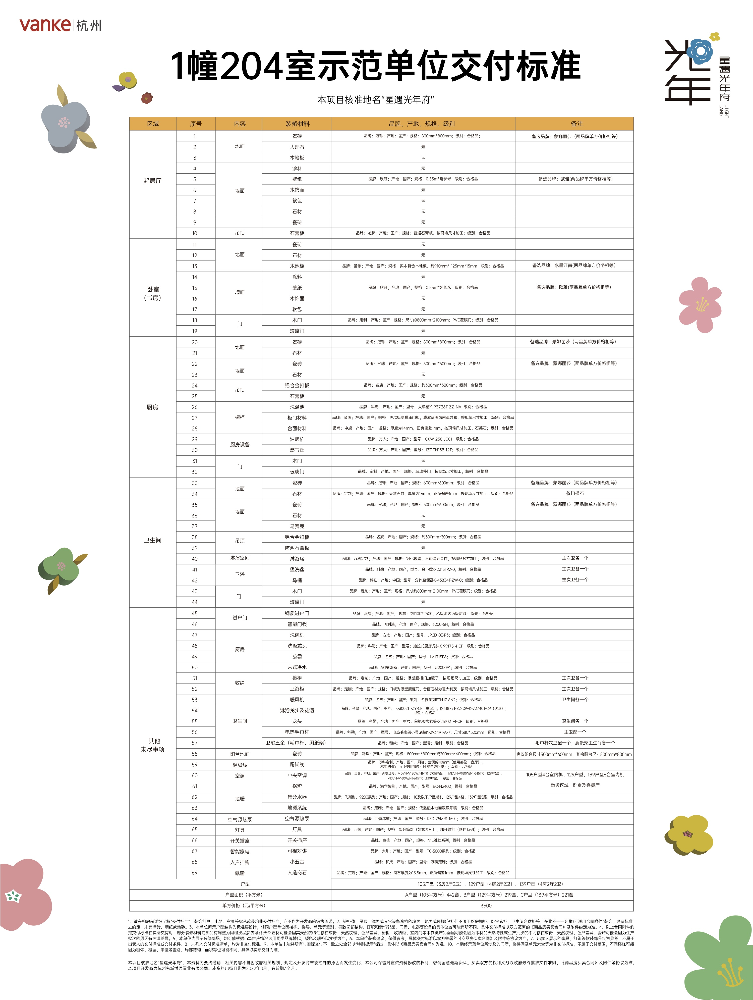
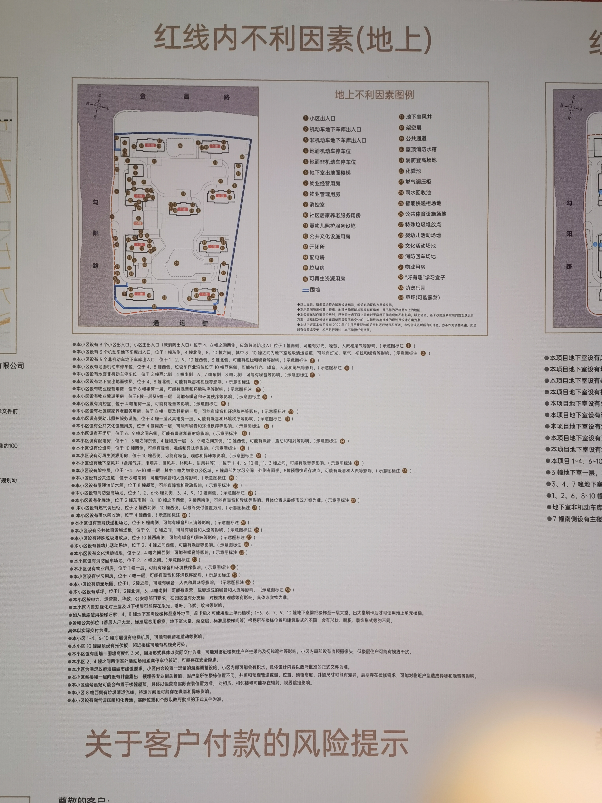
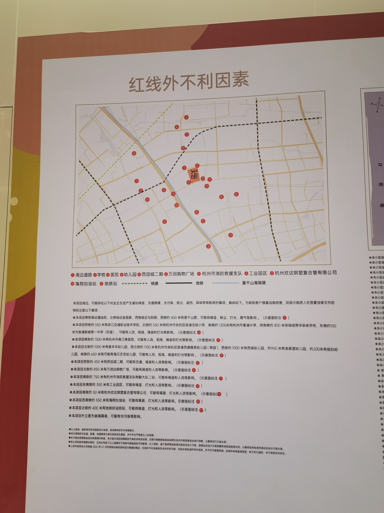
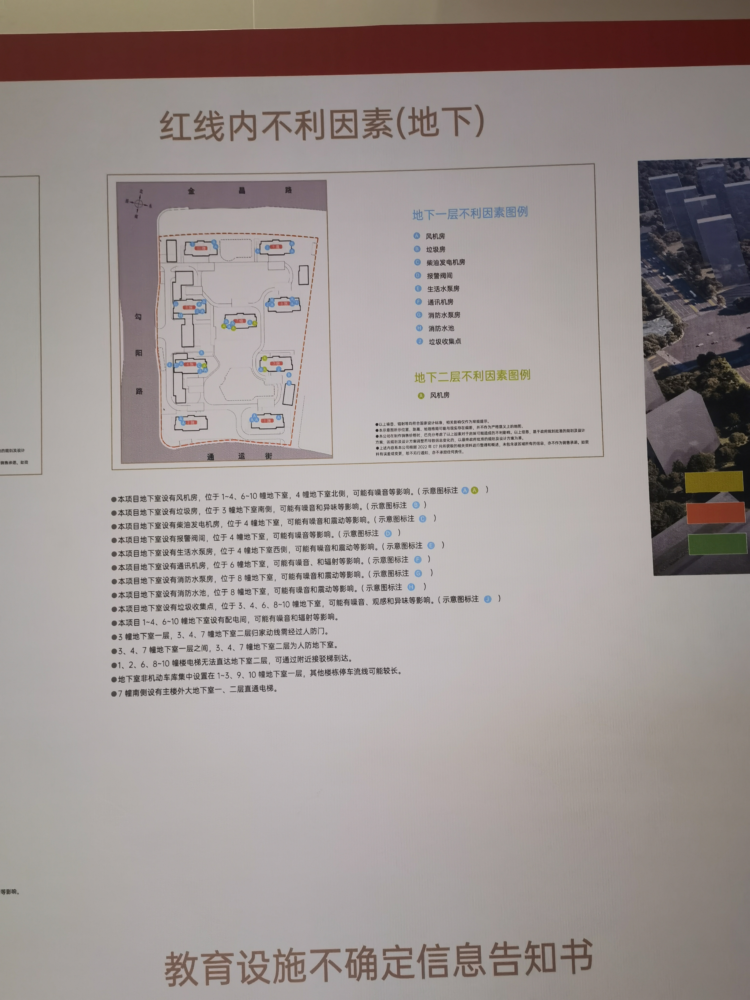
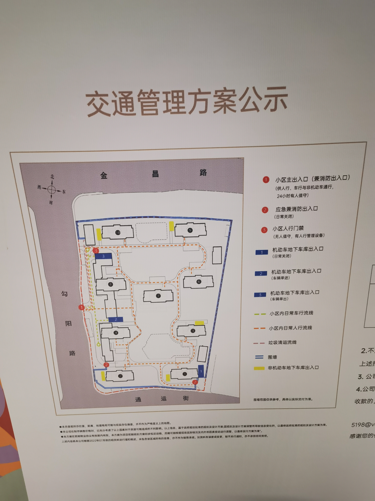
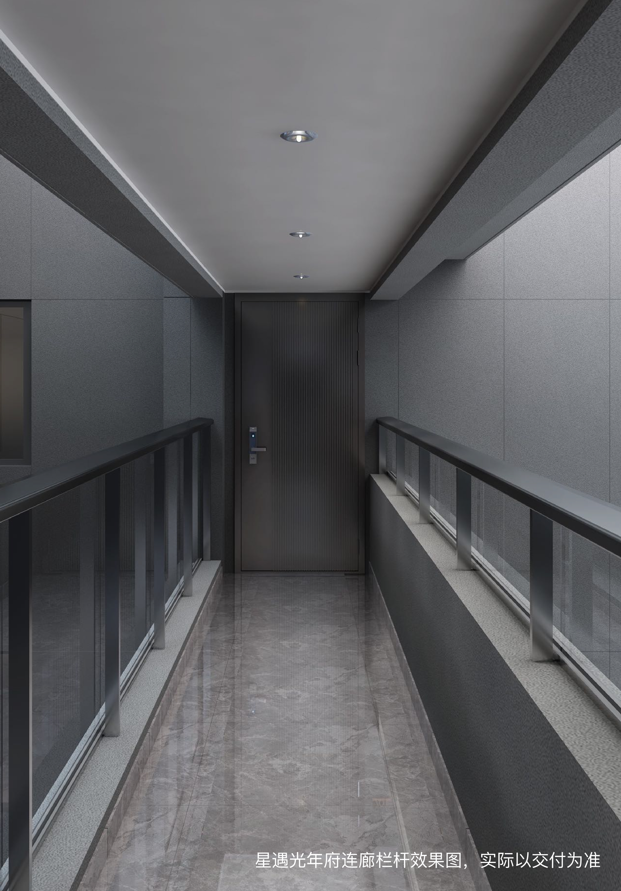

# vanke_Star_Meeting
杭州万科星遇光年府相关资料

## 一、星遇光年府位置

### 本案图例

### 本案装修清单

### 本案不利因素

###     相关规划
1. 北部新城整体规划
    [北部新城规划文档](城北中央商务区规划.pdf)
    [北部新城整体规划图](北部新城详细规划图.jpg)
2. 中心湖规划
    
## 二、本案备案合同
见文档[本案备案合同](本案备案合同.pdf)。
    
## 三、摇号流程参考
参考知乎文章 [摇号之后流程](https://zhuanlan.zhihu.com/p/399411686?utm_medium=social&utm_oi=802356528442118144&utm_psn=1548270351741841408&utm_source=wechat_session&wechatShare=2&s_r=0)
    
    
## 四、贷款相关
以下是群管理员汇总的本案贷款银行的表格:
### A、房贷

### B、车位贷

## 五、Q&A
## 1、连廊效果
目前连廊有效果图如下

